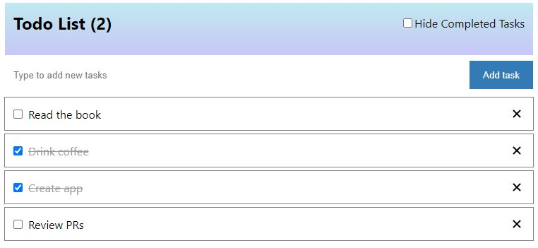

# Israel's ToDo App

This is a simple ToDo Client App created after a takehome exercise that allows the user to:

 1. **Add a task** by writing a description on the "Type to add new tasks" input field;
 2. **Mark a task as complete** by marking the checkbox on the left side of the referred task;
 3. **Delete a task** by clicking on the **x** icon on the right side of the refered task.

  Written in **Typescript** and **React.JS**, it uses **Redux Persist** with **Rematch** best practices to manage the application state and persist the data on the browser's local storage.
  The interface design tried to follow the mock-up provided in the exercise, plus an Add Task button to allow the user to either Click or press ENTER to add a new task. The user can also hide the completed tasks by clicking on the Hide Completed Tasks checkbox.

 

## How to run the app
The App is currently deployed to GitHub Pages: https://israeldeorce.github.io/todo-app/

You can **run it locally** by following these commands (you will need to have **GIT** and **Node.JS** installed):
 1. Clone the app with `$ git clone https://github.com/IsraelDeorce/todo-app.git`
 2. On the app's folder, run `$ npm install`
 3. Run `$ npm start` to start the local development server
 4. Open http://localhost:3000/ to view it in the browser.

You can also run it through a container using a Docker image generated from the Dockerfile
 1. Clone the app with `$ git clone https://github.com/IsraelDeorce/todo-app.git`
 2. On the app's folder, and with docker engine running run `$ docker build -t todo-app` 
 3. Run `$ docker run -p 3000:3000 --rm todo-app`
 4. Open http://localhost:3000/ to view it in the browser.

## Testing
Tested with Jest and React Testing Library and following the best practices, most of the tests were organized around how the user experiences and interacts with the application functionalities.
You can follow the latest **test results** and **coverage** by checking the CI pipeline available on the [GitHub Actions section](https://github.com/IsraelDeorce/todo-app/actions).

To run the tests locally and generate the reports, run the following command.

    $ npm run test:cov:ci

## Considerations
It was considered to create a simple **API service** with **express** and a database (**SQLite**) to store the data for persistence, but **Redux Persist** seemed to be the easiest choice since it can easily manipulate the app state and store the data on the **browser's local storage**.

It was also considered to use **Jest+Enzyme** instead of **react-testing-library**, simply because of my broad experience with these tools. But since Enzyme is being deprecated, I decided to go for the recommended tool that is fully supported by React v18. The same applies to **Typescript** that was used instead of pure **Javascript**.

Full **E2E UI testing** with **Cypress** was not included due to the simplicity of the App and duplicity with the cheaper react-testing-library.

**Routing** (react-router) was also considered but since all the functionalities of the App could be done within a single page, it was not included.
